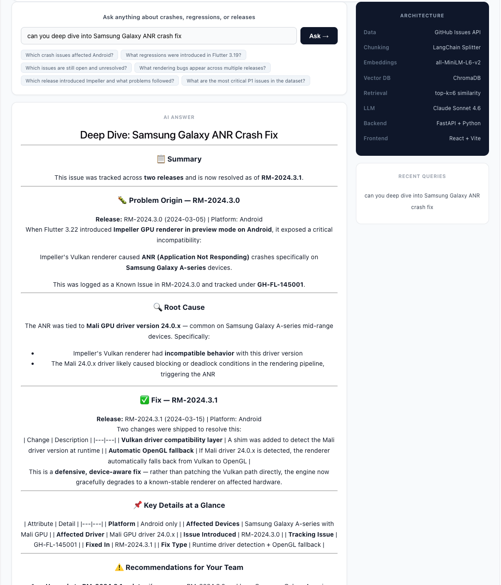

# 🛰️ ReleaseRadar

[](https://release-radar-sdk.vercel.app)
[](https://python.org)
[](https://fastapi.tiangolo.com)
[](LICENSE)

AI-powered release intelligence for mobile engineering teams. Ask natural language questions across GitHub Issues, crash events, and release notes — get precise, cited answers powered by RAG + Claude.

**Live demo → [release-radar-sdk.vercel.app](https://release-radar-sdk.vercel.app)**

---

## The Problem

When you're serving millions of users, something will break in production. And when it does, your system for understanding what happened is usually five tools that have never met each other — crash logs in one place, bug tickets in another, test cases somewhere else, RCAs in a Google Doc nobody can find two sprints later.

The teams aren't bad at their jobs. They're buried under the coordination tax of tools built for one thing and terrible at talking to each other.

The crash happens. The sprint ends. The doc gets filed. And the next time the same pattern surfaces, everyone starts from scratch.

ReleaseRadar fixes that.

---

[](https://release-radar-sdk.vercel.app/)

---

## How It Works

```
GitHub Issues + Release Notes
        ↓
sentence-transformers (all-MiniLM-L6-v2) → 384-dim embeddings
        ↓
ChromaDB vector store
        ↓
similarity search (top-k=6)
        ↓
Claude Sonnet — grounded generation with source citation
        ↓
React frontend
```

## Stack

| Layer | Technology |
|---|---|
| Embeddings | sentence-transformers all-MiniLM-L6-v2 |
| Vector Store | ChromaDB |
| LLM | Anthropic Claude Sonnet |
| Backend | FastAPI + Python |
| Frontend | React + Vite |
| Data | GitHub Issues API (flutter/flutter, facebook/react-native) |

---

## Quickstart

Clone and set up:

    git clone https://github.com/jsingh6/ReleaseRadar
    cd ReleaseRadar/backend
    python3 -m venv venv && source venv/bin/activate
    pip install -r requirements.txt

Configure:

    echo "ANTHROPIC_API_KEY=your_key" > .env
    echo "GITHUB_TOKEN=your_token" >> .env

Fetch real data and run:

    python fetch_data.py
    python main.py

Frontend:

    cd frontend && npm install && npm run dev

---

## Sample Queries

- "Which crash issues affected Android and have been fixed?"
- "Did this auth regression appear in a previous release?"
- "Which open bugs have active crash signals right now?"
- "What changed in the last release that correlates with this error spike?"
- "What are the most critical P1 issues in the dataset?"

---

## Extending with Your Own Data

Point fetch_data.py at your own sources:

**Jira**

    fetch_jira_issues(jira_url, api_token, project_key="YOUR_PROJECT")

**Firebase Crashlytics**

    fetch_crashlytics(firebase_project_id, credentials_path)

**Splunk**

    fetch_splunk_events(splunk_url, token, search_query)

Each connector normalizes to the same dict shape — id, summary, description, platform, component, status — so the RAG pipeline doesn't care where the data came from.

---

## Architecture Decision

ReleaseRadar deliberately avoids LangChain in production. The pipeline uses raw sentence-transformers + chromadb for two reasons: fewer transitive dependencies, and full visibility into what the embedding and retrieval layers are doing. LangChain is great for prototyping — when you need production stability and debuggability, owning the pipeline matters.

---

## Contributing

Contributions welcome. Open issues for ideas:

- Jira connector
- Firebase Crashlytics connector
- Splunk connector
- Rate limiting on /query endpoint
- Persistent ChromaDB (currently in-memory on Railway)

---

## Author

**Jaspreet Singh** — Principal Mobile & Quality Engineer
[LinkedIn](https://linkedin.com/in/jaspreetsjsu) · [GitHub](https://github.com/jsingh6)

---

## License

MIT
